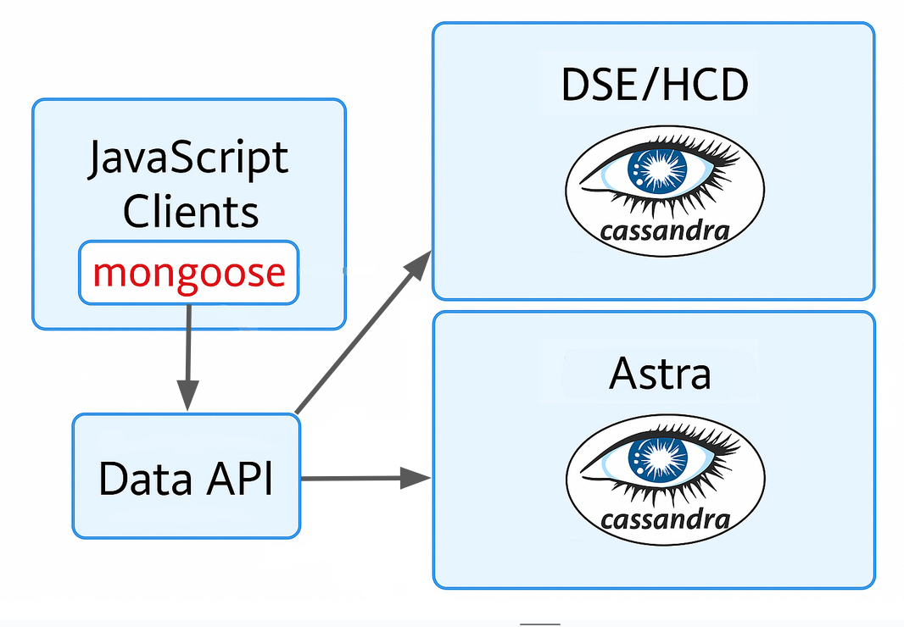

# astra-mongoose 

`astra-mongoose` is a Mongoose driver for [Data API](https://github.com/stargate/data-api) which runs on top of Apache Cassandra / DataStax Enterprise.

1. [Quickstart](#quickstart)
2. [Architecture](#architecture)
3. [Version compatibility](#version-compatibility)
4. [Connecting to AstraDB](#connecting-to-astradb)
5. [Sample Applications](#sample-applications)
6. [Features Using Collections](#features-using-collections)
7. [Features Using Tables](#features-using-tables)
8. [API Reference](APIReference.md)
9. [Developer Guide](DEVGUIDE.md)

## Quickstart
Prerequisites:
node (>=20.0.0), npm/yarn, Docker (for testing locally using docker compose)
- Start `Docker` on your local machine.
- Clone this repository
```shell
git clone https://github.com/stargate/stargate-mongoose.git
cd stargate-mongoose
```
- Execute below script and wait for it to complete, which starts a simple Data API on local with a DSE 6.8 (DataStax Enterprise) as database backend.

For macOS/Linux
```shell
bin/start_data_api.sh
```
For Windows
```shell
bin\start_data_api.cmd
```
- Create a sample project called 'sample-app'
```shell
mkdir sample-app
cd sample-app
```
- Initialize and add required dependencies
```shell
npm init -y && npm install express mongoose astra-mongoose
```
OR
```shell
yarn init -y && yarn add express mongoose astra-mongoose
```


- Create a file called `index.js` under the 'sample-app' directory and copy below code into the file.
```typescript
//imports
const express = require('express');
const mongoose = require('mongoose');
const { driver } = require('astra-mongoose');
const Schema = mongoose.Schema;

//override the default native driver
mongoose.setDriver(driver);

//Set up mongoose & end points definition
const Product = mongoose.model('Product', new Schema({ name: String, price: Number }));
mongoose.connect('http://localhost:8181/v1/inventory', {
    username: 'cassandra',
    password: 'cassandra'
});
Object.values(mongoose.connection.models).map(Model => Model.init());
const app = express();
app.get('/addproduct', (req, res) => {
    const newProduct = new Product(
        {
            name: 'product' + Math.floor(Math.random() * 99 + 1),
            price: '' + Math.floor(Math.random() * 900 + 100)
        });
    newProduct.save();
    res.send('Added a product!');
});
app.get('/getproducts', (req, res) => {
    Product.find()
        .then(products => res.json(products));
});

//Start server
const HOST = '0.0.0.0';
const PORT = 8097;
app.listen(PORT, HOST, () => {
    console.log(`Running on http://${HOST}:${PORT}`);
    console.log('http://localhost:' + PORT + '/addproduct');
    console.log('http://localhost:' + PORT + '/getproducts');
});
```
- Execute below to run the app & navigate to the urls listed on the console
```shell
node index.js
```

- Stop the Data API once the test is complete
```shell
docker compose -f bin/docker-compose.yml down -v
```

## Architecture
### High level architecture


### Components
- Cassandra Cluster - Apache Cassandra / DataStax Enterprise Cluster as backend database.
- Data API - [Data API](https://github.com/stargate/data-api) is an open source HTTP API that allows interacting with Apache Cassandra/DSE Cluster.
- JavaScript Clients that use Mongoose - Mongoose is an elegant MongoDB object modeling library for Node.js applications. By implementing a driver required by the Mongoose interface to connect to Data API instead of native MongoDB access layer, now a JavaScript client can store/retrieve documents on an Apache Cassandra/DSE Cluster.
- Astra - [Astra](https://www.datastax.com/products/datastax-astra) is a managed DBaaS service that provides a fully managed Cassandra database service. Astra includes a managed Data API service that allows interacting with data stored in Astra.
- Stargate - [Stargate](https://github.com/stargate/stargate) is an open source project that provides a RESTful API for interacting with Apache Cassandra/DSE Cluster. Data API currently relies on Stargate internally.

The current implementation of the Data API uses DataStax Enterprise (DSE) as the backend database.

## Version compatibility
| Component/Library Name | Version            |
|------------------------|--------------------|
| Mongoose               | ^8.14.0            |
| data-api               | 1.x                |
| DataStax Enterprise    | 6.8.x              |
| Astra                  | Current            |

CI tests are run using the Stargate and Data API versions specified in the [api-compatibility.versions](api-compatibility.versions) file.

## Connecting to AstraDB

Here's a quick way to connect to AstraDB using `astra-mongoose` driver.

```typescript
const mongoose = require("mongoose");
const { driver, createAstraUri } = require("astra-mongoose");

const uri = createAstraUri(
  process.env.ASTRA_DB_API_ENDPOINT,
  process.env.ASTRA_DB_APPLICATION_TOKEN,
  process.env.ASTRA_DB_NAMESPACE // optional
);

mongoose.setDriver(driver);

await mongoose.connect(uri, {
  isAstra: true,
});
```

And the step-by-step instructions with a sample application can be found here in below guide.

https://docs.datastax.com/en/astra/astra-db-vector/api-reference/data-api-with-mongoosejs.html

## Sample Applications

Sample applications developed using `astra-mongoose` driver are available in below repository.

https://github.com/stargate/stargate-mongoose-sample-apps

## Features Using Collections

### Connection APIs
| <nobr>Operation Name</nobr> | Description                                                                                                                                           |
|-----------------------------|-------------------------------------------------------------------------------------------------------------------------------------------------------|
| createDatabase              | When flag `createNamespaceOnConnect` is set to `true` the keyspace passed on to the `mongoose.connect` function via the URL, is created automatically. Not supported on Astra. |
| dropDatabase                | Drops the database (not supported on Astra)                                                                                                                                    |
| createCollection            | `mongoose.model('ModelName',modelSchema)` creates a collection as required                                                                            |
| dropCollection              | `model.dropCollection()` drops the collection                                                                                                         |


### Collection APIs
| <nobr>Operation Name</nobr> | Description                                                                                                                                                                                                                                                                                                                                                                                                                                                                                                                                                                                    |
|-----------------------------|------------------------------------------------------------------------------------------------------------------------------------------------------------------------------------------------------------------------------------------------------------------------------------------------------------------------------------------------------------------------------------------------------------------------------------------------------------------------------------------------------------------------------------------------------------------------------------------------|
| countDocuments              | `Model.countDocuments(filter)` returns the count of documents                                                                                                                                                                                                                                                                                                                                                                                                                                                                                                                                  |
| deleteMany                  | `Model.deleteMany(filter)`.                                                                                                                                                                                                                                                                                                                                                                                                                                                                                |
| deleteOne                   | `Model.deleteOne(filter, options)` options - `sort`                                                                                                                                                                                                                                                                                                                                                                                                                                                                                                                                            |
| find                        | `Model.find(filter, projection, options)`  options - `limit`, `pageState`, `skip`, `sort` (skip works only with sorting)                                                                                                                                                                                                                                                                                                                                                                                                                                                                       |
| findOne                     | `Model.findOne(filter, options)` options - `sort` Example: `findOne({}, { sort: { username: -1 } })`                                                                                                                                                                                                                                                                                                                                                                                                                                                                                           |
| findOneAndDelete            | `Model.findOneAndDelete(filter, options)` options - `sort`                                                                                                                                                                                                                                                                                                                                                                                                                                                                                                                                     |
| findOneAndReplace           | `Model.findOneAndReplace(filter, replacement, options)`<br>__options__<br>` upsert:` (default `false`)<br>`true` - if a document is not found for the given filter, a new document will be inserted with the values in the filter (eq condition) and the values in the `$set` and `$setOnInsert`operators.<br>`false` - new document will not be inserted when no match is found for the given filter<br/>--------<br/>`returnDocument`: (default `before`)<br/>`before` - Return the document before the changes were applied<br/>`after` - Return the document after the changes are applied |
| findOneAndUpdate            | `Model.findOneAndUpdate(filter, update, options)`<br>__options__<br>` upsert:` (default `false`)<br>`true` - if a document is not found for the given filter, a new document will be inserted with the values in the filter (eq condition) and the values in the `$set` and `$setOnInsert`operators.<br>`false` - new document will not be inserted when no match is found for the given filter<br/>--------<br/>`returnDocument`: (default `before`)<br/>`before` - Return the document before the changes were applied<br/>`after` - Return the document after the changes are applied       |                                                                                                                                                                                                                                                                                                                                                                                                                                                                                                                           |
| insertMany                  | `Model.insertMany([{docs}], options)` In a single call, only 20 records can be inserted. options - `ordered`                                                                                                                                                                                                                                                                                                                                                                                                                                                                                   |
| insertOne                   | `Model.insertOne({doc})`                                                                                                                                                                                                                                                                                                                                                                                                                                                                                                                                                                       |
| updateMany                  | `Model.updateMany(filter, update, options)`<br/>__options__<br>` upsert:` (default `false`)<br>`true` - if a document is not found for the given filter, a new document will be inserted with the values in the filter (eq condition) and the values in the `$set` and `$setOnInsert`operators.<br>`false` - new document will not be inserted when no match is found for the given filter<br><br/>** _This API will throw an error when more than 20 records are found to be updated._                                                                                                        |
| updateOne                   | `Model.updateOne(filter, update, options)`<br>__options__<br>` upsert:` (default `false`)<br>`true` - if a document is not found for the given filter, a new document will be inserted with the values in the filter (eq condition) and the values in the `$set` and `$setOnInsert`operators.<br>`false` - new document will not be inserted when no match is found for the given filter<br/>--------<br/>`returnDocument`: (default `before`)<br/>`before` - Return the document before the changes were applied<br/>`after` - Return the document after the changes are applied              |

### Filter Clause
| Operator           | Description                                                                                                                                                    |
|--------------------|----------------------------------------------------------------------------------------------------------------------------------------------------------------|
| literal comparison | Equal to. Example: `{ 'first_name' : 'jim' }`                                                                                                                  |
| $eq                | Example: `{ 'first_name' : { '$eq' : 'jim' } }`                                                                                                                |
| $gt                | Example (age > 25): `{ 'age' : { '$gt' : 25 } }`                                                                                                |
| $gte               | Example (age >= 25): `{ 'age' : { '$gte' : 25 } }`                                                                                              |
| $lt                | Example (age < 25): `{ 'age' : { '$lt' : 25 } }`                                                                                                |
| $lte               | Example (age <= 25): `{ 'age' : { '$lte' : 25 } }`                                                                                              |
| $ne                | Example: `{ 'first_name' : { '$ne' : 'jim' } }`                                                                                   |
| $in                | Example: `{ '_id' : { '$in' : ['nyc', 'la'] } }`                                                       |
| $nin               | Example: `{ 'address.city' : { '$nin' : ['nyc', 'la'] } }`                                                                                      |
| $not               | Not supported.                                                                                    |
| $exists            | Example: `{ 'address.city' : { '$exists' : true} }`                                                                                                            |
| $all               | Array operation. Matches if all the elements of an array matches the given values. Example: `{ 'tags' : { '$all' : [ 'home', 'school' ] } }`                   |
| $elemMatch         | Not supported. Matches if the elements of an array in a document matches the given conditions. Example: `{'goals': { '$elemMatch': { '$gte': 2, '$lt': 10 }}}` |
| $size              | Array Operation. Example: `{ 'tags' : { '$size' : 1 } }`                                                                                                       |
| $and (implicit)    | Logical expression. Example : ` { '$and' : [ {first_name : 'jim'}, {'age' : {'$gt' : 25 } } ] } `                                                              |
| $and (explicit)    | Example : ` { '$and' : [ {first_name : 'jim'}, {'age' : {'$gt' : 25 } } ] } `                                                                   |
| $or                | Example: `{ '$or' : [ {first_name : 'jim'}, {'age' : {'$gt' : 25 } } ] }`                                                                                                                                              |

### Projection Clause
| Operator                | Description                                                                                                                      |
|-------------------------|----------------------------------------------------------------------------------------------------------------------------------|
| $elemMatch (projection) | Not supported                                                                                                                    |
| $slice                  | Array related operation. Example: `{ 'tags' : { '$slice': 1 }}` returns only the first element from the array field called tags. |
| $ (projection)          | Example: Model.find({}, { username : 1, _id : 0}) - This returns username in the response and the _id field                      |

### Sort Clause
| Operator          | Description   |
|-------------------|---------------|
| Single Field Sort | Supported     |
| Multi Field Sort  | Not supported |

### Update Clause
| Operator     | Description                                                                                                                                                                       |
|--------------|-----------------------------------------------------------------------------------------------------------------------------------------------------------------------------------|
| $inc         | Example: `{ '$inc': { 'points' : 5 } }`                                                                                                                                           |
| $min         | Example: `{ 'col': { '$min' : 5 } }` if the columns value is greater than 5, it will be updated with 5                                                                            |
| $max         | Example: `{ 'col': { '$max' : 50 } }` if the columns value is lesser than 50, it will be updated with 50                                                                          |
| $rename      | Example: `{ $rename: { '$max' : 50 } }` if the columns value is lesser than 50, it will be updated with 50                                                                        |
| $set         | Example: `{'update' : {'$set': {'location': 'New York'} }}`                                                                                                                       |
| $setOnInsert | Example: `{'update' : {'$set': {'location': 'New York'}, '$setOnInsert': {'country': 'USA'} }}`                                                                                   |
| $unset       | Example: `{'update' : {'$unset': [address.location] }}`                                                                                                                           |
| $addToSet    | Example: `{'$addToSet' : {'points': 10}}`. This will add 10 to an array called `points` in the documents, without duplicates (i.e. ll skip if 10 is already present in the array) |
| $pop         | Example: `{'$pop' : {'points': 1 }}`. This removes the last 1 item from an array called `points`. -1 will remove the first 1 item.                                                |
| $pull        | Not supported                                                                                                                                                                     |
| $push        | Example. `'$push': {'tags': 'work'}`. This pushes an element called `work` to the array `tags`                                                                                    |
| $pullAll     | Not supported                                                                                                                                                                     |


### Index Operations

Index operations are not supported.

### Aggregation Operations

Aggregation operations are not supported.

### Transaction Operations

Transaction operations are not supported.

### Vector Search

Vector search is supported. Define a `$vector` property in your schema, and you can sort documents by their distance to a given vector using `sort({ $vector: { $meta } })` as follows.

```typescript
const vectorSchema = new Schema(
    {
        $vector: { type: [Number], default: () => void 0, select: true },
        name: 'String'
    },
    {
        // Create a collection with a 2-dimensional $vector property
        collectionOptions: { vector: { dimension: 2, metric: 'cosine' } },
        autoCreate: false
    }
);
const Vector = mongoose.model('Vector', vectorSchema);
await Vector.createCollection();

// Find vectors that are closest to [1, 99]
const res = await Vector.find({}).sort({ $vector: { $meta: [1, 99] } });
```

### Vectorize

Vectorize is supported. Define a `$vectorize` string property in your schema, and you can insert documents with a vector as follows.

```typescript
const vectorSchema = new Schema(
    {
        $vector: { type: [Number], default: () => void 0, dimension: 1024 },
        $vectorize: { type: String },
        name: 'String'
    },
    {
        collectionOptions: {
            vector: {
                dimension: 1024,
                metric: 'cosine',
                service: { provider: 'nvidia', modelName: 'NV-Embed-QA' }
            }
        },
        autoCreate: false
    }
);
const Vector = mongooseInstance.model('Vector', vectorSchema);

const { _id } = await Vector.create({ name: 'Moby-Dick', $vectorize: 'Call me Ishmael.' });
// Need `select({ '*': 1 })` because Data API excludes $vector and $vectorize by default
const doc = await Vector.findById(_id).select({ '*': 1 }).orFail();

doc.$vectorize; // 'Call me Ishmael.'
doc.$vector; // Length 1024 array of numbers calculated by the embedding provider
```

## Features Using Tables

You can enable the `useTables` option in the connection string to use the Tables API as opposed to the Collections API.
The following operations are supported in the tables API.

### Connection APIs
| <nobr>Operation Name</nobr> | Description                                                                                                                                           |
|-----------------------------|-------------------------------------------------------------------------------------------------------------------------------------------------------|
| createDatabase              | When flag `createNamespaceOnConnect` is set to `true` the keyspace passed on to the `mongoose.connect` function via the URL, is created automatically. Not supported on Astra. |
| dropDatabase                | Drops the database (not supported on Astra)                                                                                                                                    |
| createTable            | `connection.createTable()`                                                                      |
| dropTable              | `connection.dropTable()`

### Table APIs
| <nobr>Operation Name</nobr> | Description                                                                                                                                                                                                                                                                                                                                                                                                                                                                                                                                                                                    |
|-----------------------------|------------------------------------------------------------------------------------------------------------------------------------------------------------------------------------------------------------------------------------------------------------------------------------------------------------------------------------------------------------------------------------------------------------------------------------------------------------------------------------------------------------------------------------------------------------------------------------------------|
| countDocuments              | Not supported                                                                                                                                                                                                                                                                                                                                                                                                                                                                                                                                  |
| deleteMany                  | `Model.deleteMany(filter)`.                                                                                                                                                                                                                                                                                                                                                                                                                                                                                |
| deleteOne                   | `Model.deleteOne(filter, options)` Must specify `_id` in filter                                                                                                                                                                                                                                                                                                                                                                                                                                                                                                                                            |
| find                        | `Model.find(filter, projection, options)`  options - `limit`, `skip`, `sort` (skip works only with sorting)                                                                                                                                                                                                                                                                                                                                                                                                                                                                       |
| findOne                     | `Model.findOne(filter, options)` options - `sort` Example: `findOne({}, { sort: { username: -1 } })`                                                                                                                                                                                                                                                                                                                                                                                                                                                                                           |
| findOneAndDelete            | Not supported                                                                                                                                                                                                                                                                                                                                                                                                                                                                                                                                     |
| findOneAndReplace           | Not supported |
| findOneAndUpdate            | Not supported       |                                                                                                                                                                                                                                                                                                                                                                                                                                                                                                                           |
| insertMany                  | `Model.insertMany([{docs}], options)`                                                                                                                                                                                                                                                                                                                                                                                                                                                                                    |
| insertOne                   | `Model.insertOne({doc})`                                                                                                                                                                                                                                                                                                                                                                                                                                                                                                                                                                       |
| updateMany                  | Not supported                                                                                                        |
| updateOne                   | `Model.updateOne(filter, update, options)`<br>__options__<br>` upsert:` (default `false`)<br>`true` - if a document is not found for the given filter, a new document will be inserted with the values in the filter (eq condition) and the values in the `$set` and `$setOnInsert`operators.<br>`false` - new document will not be inserted when no match is found for the given filter              |

### Filter Clause
| Operator           | Description                                                                                                                                                    |
|--------------------|----------------------------------------------------------------------------------------------------------------------------------------------------------------|
| literal comparison | Equal to. Example: `{ 'first_name' : 'jim' }`                                                                                                                  |
| $eq                | Example: `{ 'first_name' : { '$eq' : 'jim' } }`                                                                                                                |
| $gt                | Example (age > 25): `{ 'age' : { '$gt' : 25 } }`                                                                                                |
| $gte               | Example (age >= 25): `{ 'age' : { '$gte' : 25 } }`                                                                                              |
| $lt                | Example (age < 25): `{ 'age' : { '$lt' : 25 } }`                                                                                                |
| $lte               | Example (age <= 25): `{ 'age' : { '$lte' : 25 } }`                                                                                              |
| $ne                | Example: `{ 'first_name' : { '$ne' : 'jim' } }`                                                                                   |
| $in                | Example: `{ '_id' : { '$in' : ['nyc', 'la'] } }`                                                         |
| $nin               | Example: `{ 'address.city' : { '$nin' : ['nyc', 'la'] } }`                                                                                      |
| $not               | Not supported.                                                                                  |
| $exists            | Not supported.                                                                                                            |
| $all               | Not supported.                   |
| $elemMatch         | Not supported. |
| $size              | Not supported.                                                                                                       |
| $and (implicit)    | Logical expression. Example : ` { '$and' : [ {first_name : 'jim'}, {'age' : {'$gt' : 25 } } ] } `                                                              |
| $and (explicit)    | Not supported.                                                                   |
| $or                | Not supported.

### Sort Clause
| Operator          | Description   |
|-------------------|---------------|
| Single Field Sort | Supported     |
| Multi Field Sort  | Not supported |

### Update Clause
| Operator     | Description                                                                                                                                                                       |
|--------------|-----------------------------------------------------------------------------------------------------------------------------------------------------------------------------------|
| $inc         | Not supported.                                                                                                                                           |
| $min         | Not supported.                                                                            |
| $max         | Not supported.                                                                          |
| $rename      | Not supported.                                                                       |
| $set         | Example: `{'update' : {'$set': {'location': 'New York'} }}`                                                                                                                       |
| $setOnInsert | Not supported.                                                                                   |
| $unset       | Example: `{'update' : {'$unset': [address.location] }}`                                                                                                                           |
| $addToSet    | Not supported. |
| $pop         | Not supported.                                                |
| $pull        | Not supported                                                                                                                                                                     |
| $push        | Not supported.                                                                                    |
| $pullAll     | Not supported.                                                                                                                                                                     |

### Index Operations

Indexes are supported. Indexes can be created using the `createIndex` method on the collection object, or by defining an index in your Mongoose schema.
However, indexes are limited to 1 key: compound indexes are not supported.

```javascript
const testSchema = new Schema({ testProperty: String, otherTestProperty: String });

testSchema.index({ testProperty: 1 });
const TestModel = mongoose.model('Test', testSchema);
await TestModel.createIndexes(); // Creates the index on `testProperty`

// Cannot do the following because it is a compound index (multiple keys).
// Throws a "indexSpec must have exactly 1 key" error
// testSchema.index({ testProperty: 1, otherTestProperty: 1 });
```

### Aggregation Operations

Aggregation operations are not supported.

### Transaction Operations

Transaction operations are not supported.

### Vector Search

Vector search is supported. Define a property of type `[Number]` with a `dimension` property and Mongoose will treat it as a vector when you use `tableDefinitionForSchema`.

```typescript
import { tableDefinitionFromSchema } from 'astra-mongoose';

const vectorSchema = new Schema(
    {
        vector: { type: [Number], default: () => void 0, dimension: 2 },
        name: 'String'
    },
    {
        autoCreate: false,
        autoIndex: false,
        versionKey: false
    }
);

const Vector = mongoose.model('VectorTable', vectorSchema, 'vector_table');

// Create table and vector index
await mongoose.connection.createTable('vector_table', tableDefinitionFromSchema(vectorSchema));
await mongoose.connection.collection('vector_table').createVectorIndex('vectortables', 'vector');

// Find vectors that are closest to [1, 99]
const res = await Vector.find({}, null, { includeSimilarity: true }).sort({ vector: { $meta: [1, 99] } });
```

### Vectorize

Vectorize is supported. Use the `Vectorize` type exported by astra-mongoose.

```typescript
import { tableDefinitionFromSchema, Vectorize } from 'astra-mongoose';

// Define raw document type override because Mongoose's TypeScript support can't infer the type of Vectorize
interface IVector {
    vector: string | number[] | null;
    name?: string | null;
}
const vectorSchema = new Schema<IVector>({ name: 'String' }, { autoCreate: false });
// Add the vectorize path using `schema.path()` and the `Vectorize` type for better TypeScript support.
// You can also do `type: Vectorize, dimension: 1024` in your schema definition.
vectorSchema.path('vector', new Vectorize('vector', {
    default: [],
    dimension: 1024,
    service: {
        provider: 'nvidia',
        modelName: 'NV-Embed-QA'
    }
}));

const Vector = mongoose.model('vector', vectorSchema, 'vector_table');

// Create table and vector index
await mongoose.connection.createTable('vector_table', tableDefinitionFromSchema(vectorSchema));
await mongoose.connection.collection('vector_table').createVectorIndex('vectortables', 'vector');

await Vector.create({ name: 'Recipe', vector: 'My Taco Recipe: 1 corn tortilla, 2 oz ground beef' });
await Vector.create({ name: 'Story', vector: 'Colorful butterflies soar high above the blooming garden' });

const doc = await Vector.findOne().sort({ vector: { $meta: 'mexican food' } }).orFail();
doc.name; // 'Recipe'
```
